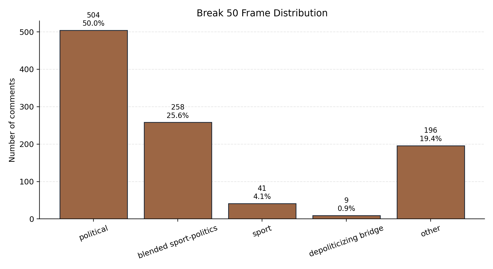
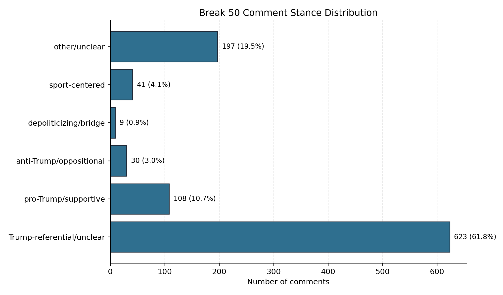
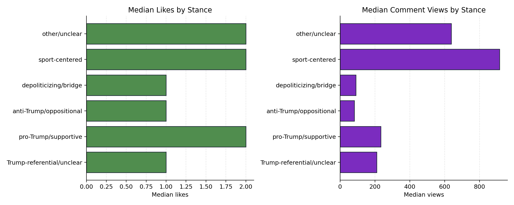
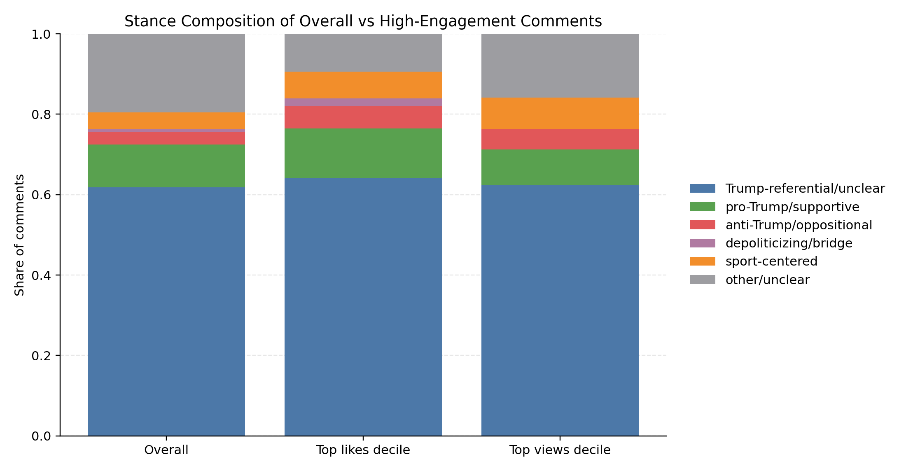

<!-- _class: lead -->

# Contested Discourse in the Break 50 Comment Field

### Stance, Framing, and Visible Reaction

**KIN 7518 — Project 3**
Group CPN · Dataset: Break 50 X/Twitter Comments
Spring 2026

---

## Research Questions

1. How is Trump's appearance in *Break 50* **framed** in the comments — as politics, as sport, or as a blend of both?
2. How are **stance positions** distributed across supportive, oppositional, depoliticizing, ambiguous, and sport-centered comments?
3. Do **visible reaction** metrics (likes, comment views) cluster differently across those discourse positions?

> `Author's attention quantity` is retained as a secondary control variable rather than the main theoretical construct.

---

## Data Overview

Public X (Twitter) comments collected around Donald Trump's July 2024 appearance on Bryson DeChambeau's *Break 50* YouTube series. Raw file is excluded from the repository per course policy.

| Metric | Value |
| --- | --- |
| Total comments | **1,008** |
| Unique usernames | 740 |
| Source posts | 4 |
| Date range | 2024-07-23 → 2024-08-01 |
| English-language comments | 920 |
| Verified accounts | 833 |
| Comments referencing Trump terms | 770 |
| Comments with moral-condemnation language | 30 |
| Comments with depoliticizing appeals | 9 |

---

## Coding Strategy

Transparent lexical coding — rules documented in [`codebook.md`](./codebook.md). Exploratory, not a substitute for full manual coding.

**Stance categories**
`pro-Trump/supportive` · `anti-Trump/oppositional` · `depoliticizing/bridge` · `Trump-referential/unclear` · `sport-centered` · `other/unclear`

**Frame categories**
`political` · `blended sport-politics` · `sport` · `depoliticizing bridge` · `other`

**Additional indicators**
`moral_condemnation` · `depoliticizing_appeal`

---

## Finding 1 — Frame Distribution

Half the conversation is framed politically; only 4% is purely sport-centered.

| Frame | Share |
| --- | --- |
| political | **50.0%** |
| blended sport-politics | 25.6% |
| other | 19.4% |
| sport | 4.1% |
| depoliticizing bridge | 0.9% |

---

## Finding 2 — Stance Distribution

A referential middle dominates. Explicit support outnumbers explicit opposition more than **3 to 1**.

| Stance | Comments | Share |
| --- | --- | --- |
| Trump-referential/unclear | 623 | 61.8% |
| pro-Trump/supportive | 108 | 10.7% |
| anti-Trump/oppositional | 30 | 3.0% |
| sport-centered | 41 | 4.1% |
| depoliticizing/bridge | 9 | 0.9% |
| other/unclear | 197 | 19.5% |

---

## Finding 3 — Engagement by Stance

`sport-centered` comments travel furthest in median views (**915**); anti-Trump comments have the lowest visibility (**82**).

| Stance | Median likes | Median views |
| --- | --- | --- |
| Trump-referential/unclear | 1.0 | 210 |
| pro-Trump/supportive | 2.0 | 234 |
| anti-Trump/oppositional | 1.0 | **82** |
| depoliticizing/bridge | 1.0 | 90 |
| sport-centered | 2.0 | **915** |
| other/unclear | 2.0 | 638 |

---

## Finding 4 — High-Engagement Composition

Top-decile comments are still dominated by the referential middle, but explicit contestation captures a larger share of top-like comments than of the overall pool.

| Stance | Overall | Top likes | Top views |
| --- | --- | --- | --- |
| Trump-referential/unclear | 61.8% | 64.2% | 62.4% |
| pro-Trump/supportive | 10.7% | 12.3% | 8.9% |
| anti-Trump/oppositional | 3.0% | **5.7%** | 5.0% |
| sport-centered | 4.1% | 6.6% | 7.9% |

---

## Controlled Checks

OLS with HC1 robust SE, controlling for verification, language, media outlets, author posting volume, and author's attention quantity.

| Outcome | Effect | b | p |
| --- | --- | --- | --- |
| log(1 + likes) | `log_attention` control | 0.137 | 0.001 |
| log(1 + comment views) | `log_attention` control | 0.239 | <0.001 |

**Takeaway:** account-level attention still predicts visible reaction, but the stance coefficients are unstable — especially for anti-Trump and depoliticizing comments, which are numerically small. Discourse categories are not replaced by attention; they need their own analysis.

---

## Takeaways

1. **The discussion is deeply politicized.** A majority of comments frame the event politically or as blended sport-politics; explicit depoliticizing appeals are rare.
2. **Explicit support outpaces explicit opposition, but neither dominates.** The largest zone is Trump-referential commentary that keeps politics active without always resolving stance.
3. **Visible reaction does not map onto partisanship.** Median views peak for sport-centered comments; top-engagement deciles remain dominated by the referential middle.

> Break 50 is a *politically saturated and unevenly negotiated discourse space* in which sport and politics are repeatedly forced together.

---

## Limitations

- Coding is **heuristic and dictionary-based**, not hand-validated by multiple coders.
- Some comments are duplicated or formulaic, which may inflate categories.
- The `Trump-referential/unclear` category is intentionally broad — ambiguity captured at the cost of precision.
- Small categories (anti-Trump, depoliticizing) yield unstable controlled estimates.
- One event, one platform, one short window — findings should not be generalized.

---

<!-- _class: lead -->

# Thank you

Full report: [`docs/final_report.md`](./final_report.md)
Analysis pipeline: [`scripts/run_analysis.py`](../scripts/run_analysis.py)
Codebook: [`docs/codebook.md`](./codebook.md)

*Render this deck with* `npx @marp-team/marp-cli docs/slides.md --pdf`
